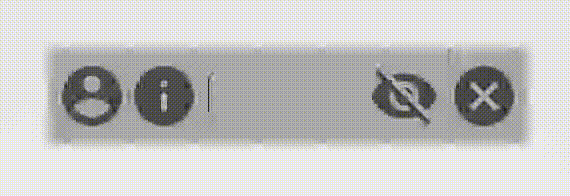

### Introduction



Use EditText with header and footer icon.

### How to use

1. xml

``` xml
<FrameLayout xmlns:android="http://schemas.android.com/apk/res/android"
    android:layout_width="match_parent"
    android:layout_height="match_parent"
    android:orientation="vertical"
    android:padding="32dp">

    <com.zlxrx.library.inputview.InputView
        android:id="@+id/inputView"
        android:layout_width="320dp"
        android:layout_height="64dp"
        android:background="@android:color/darker_gray"
        android:padding="8dp" />
</FrameLayout>
```
2. Add icon

``` kotlin
inputView.addHeaderIcon(R.drawable.ic_account, marginStart = 8, marginEnd = 8)
inputView.addFooterIcon(R.drawable.ic_info, marginStart = 8, marginEnd = 8) { icon, input ->
    Toast.makeText(this, "onIconClick, input text: $input", Toast.LENGTH_SHORT).show()
}
// Clean the input
inputView.addClearIcon(R.drawable.ic_clean_selector, marginEnd = 8) {
    Toast.makeText(this, "clean", Toast.LENGTH_SHORT).show()
}
// Make InputView as password EditText and toggle visibility of input text
inputView.addPasswordIcon(R.drawable.ic_eye_selector, 8, 8) {
    Toast.makeText(this, "password visible: $it", Toast.LENGTH_SHORT).show()
}
```

3. Drawable for InputView.addPasswordIcon()

``` xml
<selector xmlns:android="http://schemas.android.com/apk/res/android">
    <!-- show when password is visible -->
    <item android:drawable="@drawable/ic_eye_open" android:state_selected="true" />

    <!-- show when password is invisible -->
    <item android:drawable="@drawable/ic_eye_close" />
</selector>
```
